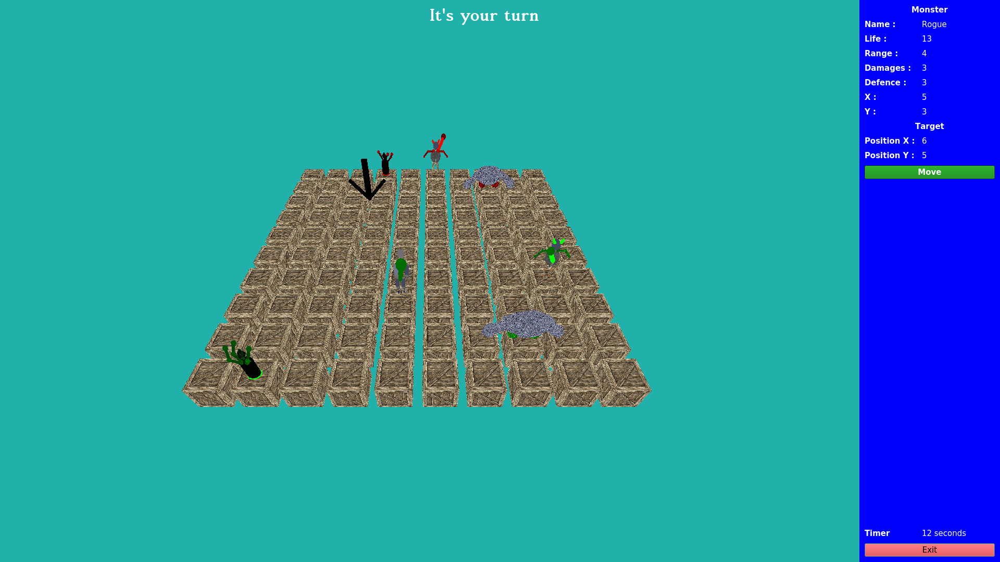

## Table des matières
1. [Info générale](#info-générale)
2. [Technologies](#technologies)
3. [Installation](#installation)
4. [Collaboration](#collaboration)
### Info Générale
***
Ce projet a été réalisé dans la cadre de la licence informatique à l'université d'Angers en 3ème année pour notre TER. 
### Screenshot

## Technologies
***
Liste des technologies utilisées dans le projet :
* [C++](https://en.cppreference.com/w/): Version 14.0 
* [Qt](https://www.qt.io/qt5-11/):Version 5.11.3
* [Qt creator](https://www.qt.io/blog/2019/03/01/qt-creator-4-8-2-released): Version 4.8.2
* [GeoGebra](https://www.geogebra.org/?lang=fr)
* [StarUML](https://staruml.io/): Version 4.0.1

## Installation
***
Pour installer le projet vous pouvez le cloner avec une clé SSH, ou bien télécharger le dossier ZIP.
```
$ git clone git@github.com:Phaeon/QtWarriors.git
```
Le paquet ```qt5-default``` doit-être installé sur votre machine.

**Compilation**

Créer un dossier build et se déplacer dedans
```
mkdir build
cd  build
```
Exécutez qmake sur votre fichier qmake pour rendre le projet spécifique à la plate-forme
```
qmake ../QtWarriors/QtWarriors.pro
```
Créer un fichier Qt exécutable pour le projet
```
make
```
Exécutez le fichier fichier QtWarriors
```
./QtWarriors
```

## Collaboration
***
Ce projer a été réalisé en collaboration avec Tanguy JOUVIN, Jack HOGG et Guillaume GRENON.
